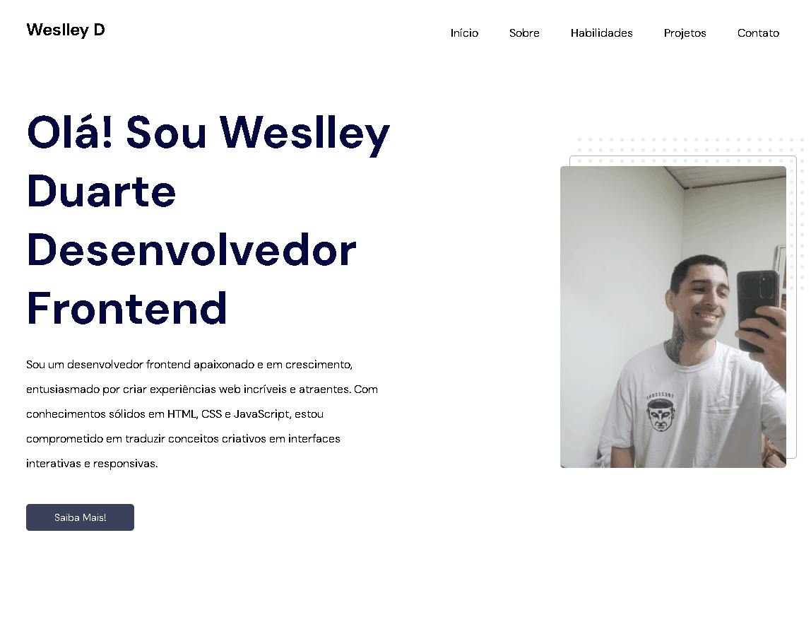

<h1 align="center">Meu Portifólio</h1>

  <a href="#-Demonstração">Demonstração</a>&nbsp;&nbsp;&nbsp;|&nbsp;&nbsp;&nbsp;
  <a href="#-tecnologias">Tecnologias</a>

Bem-vindo à minha landing page do portfólio, onde apresento meus projetos e habilidades como desenvolvedor frontend.

## 🔖 Demonstração

Você pode ver a minha landing page em ação [aqui](https://weesduarte.github.io/personalportifolio/).

  

## 🚀 Tecnologias Utilizadas

- HTML5
- CSS3
- JavaScript
- Git e Github